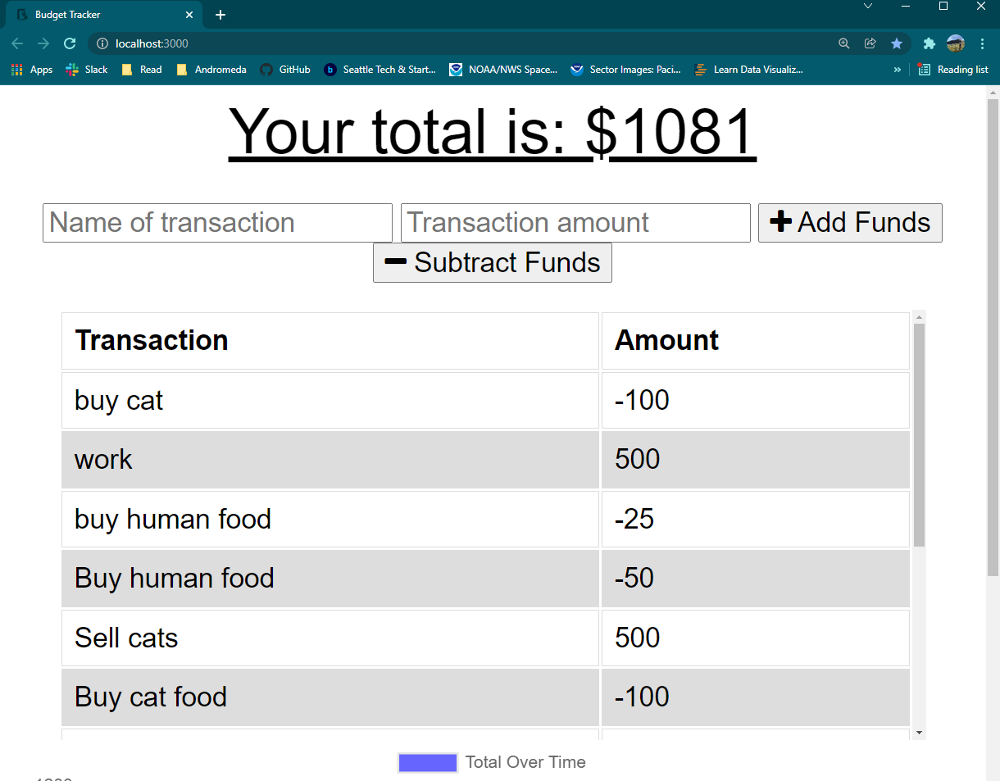
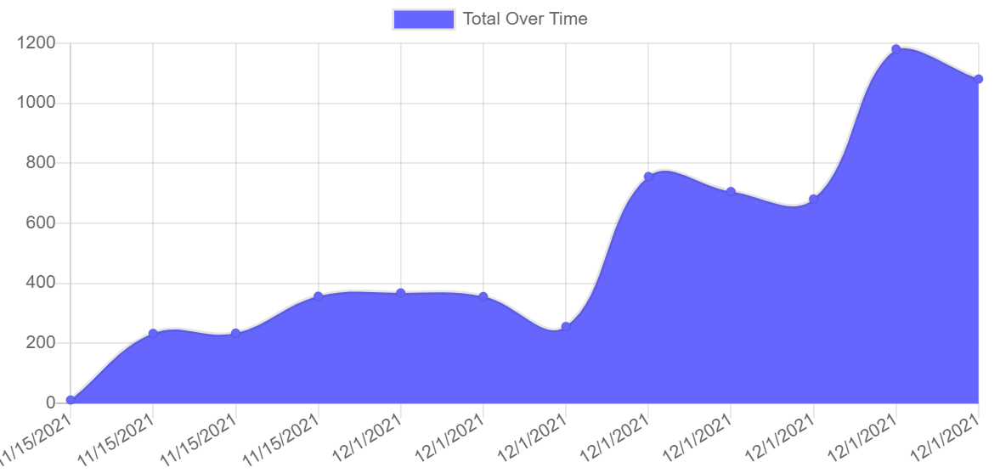

# Budget Trackers

This is a budget tracker with offline functionality added by PWAs. 

  ## Table Of Contents

  - [Usage](#usage)
  - [Deployment](#deployment)

  ## Usage

Add or remove funds from an account with labels. A graph shows the balance over time. 

You can download this app to your phone as a stand alone app that also works offline.

## Deployment

You can find this app deployed on [heroku here](https://warm-stream-23687.herokuapp.com/)
The github repository is [here](github.com/wkropat/budget-tracker)

